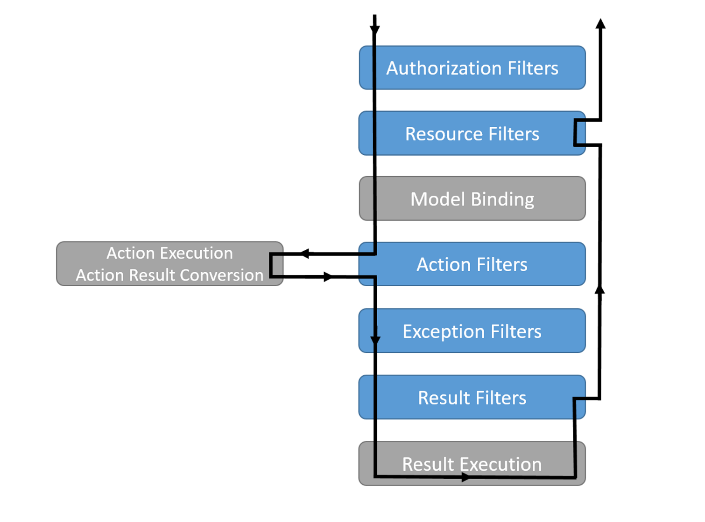

# memo

## dotnetコマンド

- dotnet new
  - プロジェクトの作成
- dotnet tool
  - ライブラリなどの管理
  - 例: `dotnet tool install dotnet-ef`

## セキュリティ


### 秘密文字列の管理

- https://qiita.com/tnishiki/items/0c3e73ed28a66591d676
- https://github.com/MicrosoftDocs/azure-docs.ja-jp/blob/master/articles/app-service/configure-common.md
- https://qiita.com/kerobot/items/ffadec344d3f3f3a4587
- https://qiita.com/tnishiki/items/f51959c94412c43e7fa5
- https://blog.beachside.dev/entry/2019/11/21/190000

#### UserSecrets

- 参考: 
  - https://learn.microsoft.com/ja-jp/aspnet/core/security/app-secrets?view=aspnetcore-7.0&tabs=windows
  - https://qiita.com/tnishiki/items/0c3e73ed28a66591d676
  - https://araramistudio.jimdo.com/2021/10/18/c-azure-app-service%E3%81%A7%E7%92%B0%E5%A2%83%E5%A4%89%E6%95%B0%E3%82%92%E5%88%A9%E7%94%A8%E3%81%99%E3%82%8B/
  - https://tech-lab.sios.jp/archives/33304

- パッケージインストール
```bash
dotnet add package Microsoft.Extensions.Configuration
dotnet add package Microsoft.Extensions.Configuration.UserSecrets
```
- 初期化
```bash
dotnet user-secrets init
```
- 設定(ローカル環境)
```bash
dotnet user-secrets set "super-secret-key" "hoge"
```
- 設定(Azure環境)
  - App Service -> 構成 -> アプリケーション設定 から「新しいアプリケーション設定」で設定可能。
-以下のように参照できる。
```cs
private readonly IConfiguration _configuration;
:
:
var str = _configuration["super-secret-key"]; // "hoge"
```


##  asp.net全体、特にDIコンテナ

### ルーティング

- 参考:[microsoft](https://learn.microsoft.com/ja-jp/aspnet/core/fundamentals/routing?view=aspnetcore-7.0)

### パイプライン

- 参考: [microsoft](https://learn.microsoft.com/ja-jp/aspnet/core/fundamentals/middleware/?view=aspnetcore-7.0)


- Run, Use, Map の3つのメソッドを使ってパイプラインを構築する。

#### Runメソッド

- パイプラインの終端となるメソッド。複数のRunメソッドを書いても、最初のRunメソッドしか実行されない。
```cs
app.Run(async context =>
{
  await context.Response.WriteAsync("Hello, World!");
});

app.Run(async context =>
{
  // 以下の部分は実行されない。
  await context.Response.WriteAsync("Hello, Again");
});
```


#### Useメソッド

- パイプラインチェーンに処理を追加する。`next.Invoke();`と書くと、後続のミドルウェアを呼び出すことができる。
```cs
// 以下のように書くと、Hello(1) -> Hello(2) -> Hello(3) の順番で実行される。
app.Use(async (context, next) =>
{
    await context.Response.WriteAsync("Hello(1)");
    // 後続のミドルウェアを呼び出す
    await next.Invoke();
    // 後続のミドルウェアの処理が終わった後に実行される
    await context.Response.WriteAsync("Hello(3)");
});

app.Run(async context =>
{
    await context.Response.WriteAsync("Hello(2)");
});
```

#### Mapメソッド

- リクエストで受けたURLのパスに応じて処理を分岐させる。
```cs
// 以下のように書くと、/hello にアクセスしたときは hello.Run が実行され、/world にアクセスしたときは world.Run が実行される。
app.Map("/hello", hello => {
    hello.Run(async context => {
        await context.Response.WriteAsync("This is hello page.");
    });
});

app.Map("/world", world => {
    world.Run(async context => {
        await context.Response.WriteAsync("This is world page.");
    });
});
```


#### 標準ミドルウェア

- 参照: https://docs.microsoft.com/ja-jp/aspnet/core/fundamentals/middleware/?view=aspnetcore-7.0#built-in-middleware
- UseAuthorization
- UseExceptionHandler
- UseStaticFiles

### Filter

- 参考: [microsoft](https://learn.microsoft.com/en-us/aspnet/core/mvc/controllers/filters?view=aspnetcore-7.0)
- リクエスト処理パイプラインの特定の段階の前または後にコードを実行することができます。
- 以下のフィルターがある
  - Authorization filters
  - Resource filters
  - Action filters
  - Endpoint filters
  - Exception filters
  - Result filters
- 以下の順序で実行される



#### ActionFilter

- null

### DIコンテナ

- https://eiken7.hatenablog.com/entry/2020/12/28/144744

## 認証認可のやり方

- JWT。
  - 参考: https://jasonwatmore.com/react-18-authentication-with-net-6-aspnet-core-jwt-api
  - [翻訳(途中まで)](dotnet6.0_JWT_Authentication_Tutorial_with_Example_API.md)
  - https://zukucode.com/2021/04/aspnet-jwt-auth.html
  - https://jasonwatmore.com/post/2021/12/14/net-6-jwt-authentication-tutorial-with-example-api#jwt-middleware-cs

## ロギングのやり方

- null

## コントローラーのいい感じの書き方

### 例外処理

- https://learn.microsoft.com/ja-jp/aspnet/web-api/overview/error-handling/exception-handling
- https://learn.microsoft.com/ja-jp/aspnet/core/web-api/handle-errors?view=aspnetcore-7.0

### swagger

- https://blog.beachside.dev/entry/2021/01/22/123000
- https://learn.microsoft.com/ja-jp/aspnet/core/tutorials/getting-started-with-swashbuckle?view=aspnetcore-7.0&tabs=visual-studio

## REST APIの設計

- RESTfulにしたい。
  - https://jasonwatmore.com/post/2021/05/25/net-5-simple-api-for-authentication-registration-and-user-management
  - [翻訳(途中まで)](simple_API_for_authentication_registration_and_user_management.md)
  - https://neos21.net/tech/design/restful-web-api.html
- status code
  - https://www.moesif.com/blog/technical/api-design/Which-HTTP-Status-Code-To-Use-For-Every-CRUD-App/
  - https://restfulapi.net/http-status-codes/
  - https://qiita.com/NagaokaKenichi/items/eb85b5fbb719d60c6627

## github actions

- null

## Azure構成

- デプロイ方法参考: https://hub.uni-face.co.jp/nextjs-csharpapi-deploy-to-azure/

## 複数プロジェクト

- https://qiita.com/unyorita/items/8a92cb19b618e8e4a4a5

## C#11.0の新機能

- [C# 11.0](https://learn.microsoft.com/ja-jp/dotnet/csharp/whats-new/csharp-11)
- [C# 10.0](https://learn.microsoft.com/ja-jp/dotnet/csharp/whats-new/csharp-10)
- [C# 9.0](https://learn.microsoft.com/ja-jp/dotnet/csharp/whats-new/csharp-9)
- [C# 8.0](https://learn.microsoft.com/ja-jp/dotnet/csharp/whats-new/csharp-8)

## docker

- null